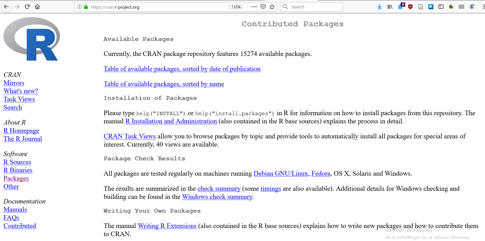
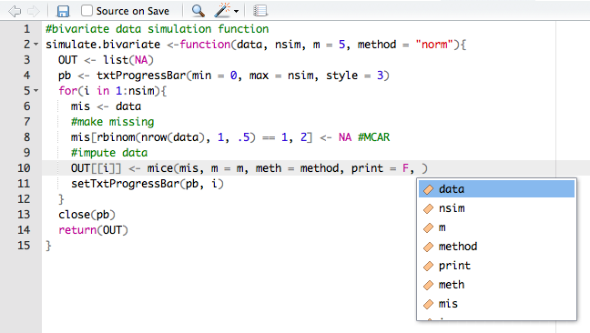

# Overview of this course
## Program
| Time            | Topic                                           |
|:----------------|:------------------------------------------------|
| *Tuesday 16th*  | Introduction to R and Rstudio                   |
| *Wednesday 17th*| Data in R, reading in and exporting data        |
| *Thursday 18th* | Data manipulation and basic statistics          |
| *Tuesday 23rd*  | Data visualisation                              |
| *Thursday 25th* | Loops and functions                             |

## Format
- Lectures followed by practicals
- Materials are on the homepage
  - "Impracticals" are the versions without solutions, "Practicals" the ones with
- Please do ask questions


# What is R?

## Software
<center>

</center>

## The origin of R
- R is a language and environment for statistical computing and for graphics

- GNU project (100% free software)

- Managed by the R Foundation for Statistical Computing, Vienna, Austria.

- Community-driven

- Based on the object-oriented language S (1975)

## The R community
- Huge, active, welcoming online community
  - #rstats
  - rweekly
  - rbloggers
  - Stack Overflow
- Package development
  - About eight packages supplied with base R
  - More than 15.000 packages on CRAN

## CRAN: Comprehensive R Archive Network

<center>

</center>

## Task views

<center>

</center>

# What is RStudio?

## Integrated Development Environment
<center>

</center>

## RStudio
- Aggregates all convenient information and procedures into one single place
- Allows you to work in projects
- Manages your code with highlighting
- Gives extra functionality (Shiny, knitr, markdown, LaTeX)
- Allows for integration with version control routines, such as Git.

# How does R work

## The help
- Everything that is published on the Comprehensive `R` Archive Network (CRAN) and is aimed at `R` users, must be accompanied by a help file. 
- If you know the name of the function that performs an operation, e.g. `anova()`, then you just type `?anova` or `help(anova)` in the console. 
- If you do not know the name of the function: type `??` followed by your search criterion. For example `??anova` returns a list of all help pages that contain the word 'anova'

- Alternatively, the internet will tell you almost everything you'd like to know (and then some)

- Sites such as http://www.stackoverflow.com and http://www.stackexchange.com, as well as `Google` can be of tremendous help. 
    - If you google `R` related issues; use 'R:' as a prefix in your search term
    
## Objects and elements
- R works with objects that consist of elements. The smallest elements are numbers and characters.

    - These elements are assigned to objects. 
    - A set of objects can be used to perform calculations
    - Calculations can be presented as functions
    - Functions are used to perform calculations and return new objects, containing calculated (or estimated) elements. 

## Assigning elements to objects
- Assigning things in R is very straightforward: 

    - you just use `<-`

- For example, if you assign the value `100` (an element) to object `a`, you would type

```{r}
a <- 100
```

- Life hack: In RStudio learn to use the shortcut "alt + -" (hyphen) to produce the left arrow `<-` in an R file


## Calling objects
- Calling things in R is also very straightforward: 

    - you just use type the name you have given to the object

- For example, we assigned the value `100` to object `a`. To call object `a`, we would type

```{r}
a
```

## Writing code
<center>

</center>

This is why we use R-Studio.

```{r echo=FALSE}
set.seed(123)
```


# Vectors and matrices

## Numerical vectors
- Several elements of the same type, e.g. the integers from 1 to 5, can be concatenated into a **vector**
```{r}
a <- c(1, 2, 3, 4, 5)
a
```

##
- As is typical for `R` there a several ways to accomplish this
```{r}
b <- 1:5
b
```

## Character vectors
- Characters (or character strings) in `R` are indicated by the double quote identifier 
```{r}
a.new <- c(a, "A")
a.new
```

- Notice the difference with `a` from the previous slide
```{r}
a
```

##
- Replicating elements to build composite vectors, e.g. repeat `a` 10 times (for one reason or another)
```{r}
rep(a, 10)
```

- Or repeat the elements of `a` 2,4,6,8, and 10 times, respectively
```{r}
rep(a, c(2,4,6,8,10))
```

##
- To call single elements in vectors, e.g. if we want to refer to the third element of `a`, we type
```{r}
a[3]
```

## Matrices
- A rectangular organization of *n* x *m* numbers in *n* rows and *m* columns is known as a **matrix**, both in `R` and more generally
```{r}
c <- matrix(a, nrow = 5, ncol = 2)
c
```

- Notice that `R` is **recycling** `a` without lettting us know!

##
- Referencing elements in a matrix is done by **indices**, e.g. the first row is called by
```{r}
c[1, ]
```

##
- The second column is called by
```{r}
c[, 2]
```

##
- The intersection of the first row and second column is called by
```{r}
c[1, 2]
```

- In short, the square brackets [] are used to call elements, rows, columns (and much more beyond the scope of this course)

## Trying to mix numerics and chars
- If we add a character column to matrix `c` everything becomes chars
```{r}
cbind(c, letters[1:5])
```

>- Vectors and matrices are 1D or 2D structures holdning elements of the **same** type (numerical or characters) - if we try to mix these two types `R` will automatically *cast* the numerical values into character values (chars)

# Data frames

## Data frames
- To keep variables of different types in a 2D structure, the simplest answer is a **data frame** 
```{r}
d <- data.frame("V1" = 1:5,
                "V2" = 10:6, 
                "V3" = letters[1:5])
d
```


##
- Data frames can contain both numerical and character elements at the same time, although never in the same column. 

- You can name the columns and rows in data frames (just like in matrices)
```{r}
row.names(d) <- c("row 1", "row 2", "row 3", "row 4", "row 5")
d
```

##
- There are (at least) two ways to obtain the third row from the data frame `d`, either using the name:
```{r}
d["row 3", ]
```

- or the position
```{r}
d[3, ]
```

##
- Calling columns in data frames can be done in precisely the same way
```{r}
d[, "V2"]
d[, 2]
```


##
- However, we can also use `$` to call variable names in data frame objects
```{r}
d$V2
```
- Thus calling column vectors we can even write
```{r}
d$V2[3:4]
```


<!-- # Beyond two dimensions:<br>Arrays and lists -->

<!-- ## Arrays -->
<!-- - If you wish to use numerical objects that have more than two dimensions, an array would be a suitable object. -->

<!-- ## -->
<!-- - The following code yields a 3-dimensional array, which may be thought of as 2 layers of a 3x4 matrix: -->
<!-- ```{r} -->
<!-- e <- array(1:24, dim = c(3, 4, 2)) -->
<!-- e -->
<!-- ``` -->

<!-- ## -->
<!-- - The square bracket identification works similarly to the identification of matrices and dataframes, but with the added dimension(s). -->
<!-- - So to get the element in the first row of the third column in the second matrix you type -->
<!-- ```{r} -->
<!-- e[1, 3, 2] -->
<!-- ``` -->
<!-- - This is exactly the downside to an array: it is a series of matrices meaning that characters and numerical elements may not be mixed...  -->

<!-- ##  -->
<!-- - So, we get problems if we replace the second matrix in the array by a character version of that same matrix -->
<!-- ```{r} -->
<!-- e[, , 2] <- as.character(e[, , 2]) -->
<!-- e -->
<!-- ``` -->
<!-- - As for matrices the entire array is cast to chars... -->

<!-- ## The solution: Lists -->
<!-- - List are just what it says they are (i.e. lists), and you can have a list where the elements are of different types  -->
<!-- - For example, create a simple list by typing -->
<!-- ```{r} -->
<!-- f <- list(a) -->
<!-- f -->
<!-- ``` -->

<!-- - Elements or objects within lists can be called by using double square brackets, e.g the first (and only) element in list `f` is vector `a` -->
<!-- ```{r} -->
<!-- f[[1]] -->
<!-- ``` -->

<!-- ## -->
<!-- - We can simply add an object or element to an existing list -->
<!-- ```{r} -->
<!-- f[[2]] <- d -->
<!-- f -->
<!-- ``` -->
<!-- - Now our list consists of a vector and a data frame! -->

<!-- ## -->
<!-- - We can add names to the list as follows -->
<!-- ```{r} -->
<!-- names(f) <- c("vector", "data frame") -->
<!-- f -->
<!-- ``` -->

<!-- ## -->
<!-- - With names to the elements we can call the vector `a` from the list as follows -->
<!-- ```{r} -->
<!-- f[[1]] -->
<!-- f[["vector"]] -->
<!-- f$vector -->
<!-- ``` -->

<!-- ## Lists in lists -->
<!-- - A construct more useful that it initially seems is a *list of lists* -->
<!-- - Here we have a list with two identical elements -->
<!-- ```{r} -->
<!-- g <- list(f, f) -->
<!-- ``` -->

<!-- ## -->
<!-- - To call the vector from the second list within the list `g`, use either of the following code -->
<!-- ```{r} -->
<!-- g[[2]][[1]] -->
<!-- g[[2]]$vector -->
<!-- ``` -->

# Logical operators

## Logical operators
- Logical operators are operators that evaluate to either `TRUE` or `FALSE`
- The most common statement include
    - `==` (equal to)
    - `<` (smaller than)
    - `>` (greater than)
    - `<=` (smaller than or equal to)
    - `>=` (greater than or equal to)
- The operators may be combined using `|` (OR) as well as `&` (AND)
- Typing `!` before a logical operator takes the complement of that action
- There are more operations, but these are the most useful 

##
- Logical operators are great for subsetting, e.g. if we would like elements out of matrix `c` that are larger than 3, we would type:
```{r}
c[c > 3]
```

- Why does a logical statement on a matrix return a vector?
```{r}
c > 3
```
- The column values for `TRUE` may be of different length. A vector as a return is therefore more appropriate 

##
- If we would like the elements that are smaller than 3 or larger than 3, we could type
```{r}
c[c < 3 | c > 3]
```
- Analysing the query we realize that this is equivalent to asking for the elements **not** equal to 3
```{r}
c[c != 3] #c not equal to 3
```

##
- To understand the mechanism see how `c != 3` actually returns a Boolean matrix
```{r echo=FALSE}
c != 3
```
- And then recall the structure of `c` 
```{r echo=FALSE}
c
```


# A few final notes

## Missing in different ways...
- Expressions that have no representation in real number space (at least not without tremendous analytical effort) results in a "Not a Number"
```{r}
0 / 0
```

- Another special value is "Infinity"
```{r}
1/0
```

##
- These values are different from missing values coded as "Not Available"
```{r}
h <- c(1, 2, NA, 4, 5)
```

- Of course the mean of a set of number including at least in NA is also impossible and therefore also missing
```{r}
mean(h)
```

## 
- There are two standard solves for missing values which should be applied only after careful consideration of why the data contains `NA`s

- One is through an additional parameters parsed to the function, e.g.
```{r}
mean(c(1, 2, NA, 4, 5), na.rm = TRUE)
```

- The other is to explicitly omit (delete) the `NA`s before calling the function - note how the calls are nested
```{r}
mean(na.omit(c(1, 2, NA, 4, 5)))
```

## Beware of comparisons that include floats
```{r}
(3 - 2.9)
(3 - 2.9) <= 0.1
(3 - 2.9) - .1
all.equal((3 - 2.9), .1)
```

# Practical

## How to approach the next practical
- Aim to make the exercises without looking at the answers
    - Use the answers to evaluate your work
    - Use the help to identify the workings of functions
- If this does not work out then switch to the answer-based practical 
- In any case feel free to ask for help when needed 
    - Do not struggle for too long since we only have limited time!

# Practical A

