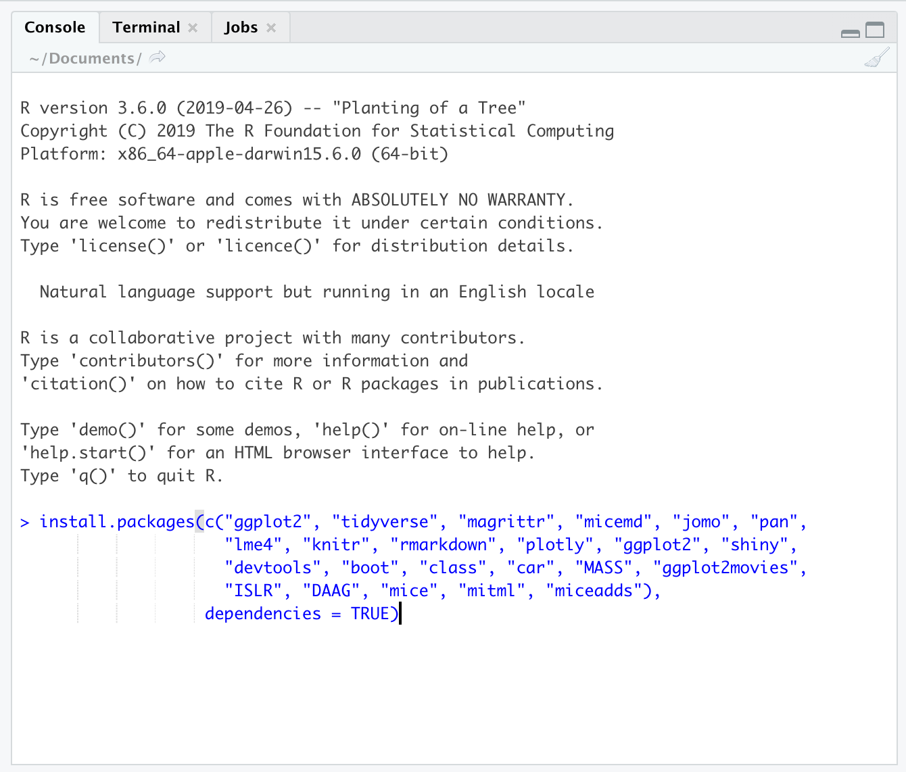

# Intro{.sidebar}

This dashboard covers the materials for the course introducing R. Course held for GeoStat, February 2021.

---

Instructors: 

 - Anne Vinkel Hansen (aih@dst.dk)
 - Signe Hermann (she@dst.dk)
 - Jolien Cremers (x39@dst.dk)


---

Material adopted from [Gerko Vink](https://github.com/gerkovink/R)


---
# Quick Overview

## Column 1

### Outline
R is rapidly becoming the standard platform for data manipulation, visualization and analysis and has a number of advantages over other statistical software packages. A wide community of users contribute to R, resulting in an enormous coverage of statistical procedures, including many that are not available in any other statistical program. Furthermore, it is highly flexible for programming and scripting purposes, for example when manipulating data or creating professional plots. However, R lacks standard GUI menus, as in SPSS for example, from which to choose what statistical test to perform or which graph to create. As a consequence, R is more challenging to master. Therefore, this course offers an introduction to statistical programming in R. Students learn to operate R, make plots, and do advanced statistical programming and data manipulation. 


The course deals with the following topics:

1.	An introduction to the R environment.
2.  Getting data into and out of R 
3.  Data manipulation and basic statistics 
4.	Data visualisation
5.  Basic to advanced programming skills: Loops and functions

The course starts at a very basic level and builds up gradually. No previous experience with R is required.

## Column 2

### Course schedule 

| Time            | Topic                                           |
|:----------------|:------------------------------------------------|
| *Tuesday 16th*  | Introduction to R and Rstudio                   |
| *Wednesday 17th*| Data in R, reading in and exporting data        |
| *Thursday 18th* | Data manipulation and basic statistics          |
| *Tuesday 23rd*  | Data visualisation                              |
| *Thursday 25th* | Loops and functions                             |


# How to prepare

## Column 1

### Preparing your machine for the course
Dear all, 

The below steps guide you through installing both `R` as well as the necessary additions.

I look forward to see you all,  

*Anne*

### **System requirements**

Bring a laptop computer to the course and make sure that you have full write access and administrator rights to the machine. We will explore programming and compiling in this course. This means that you need full access to your machine. Some corporate laptops come with limited access for their users, we therefore advice you to bring a personal laptop computer, if you have one. 

### **1. Install `R`**
`R` can be obtained [here](https://cran.r-project.org). We won't use `R` directly in the course, but rather call `R` through `RStudio`. Therefore it needs to be installed. 

### **2. Install `RStudio` Desktop**

Rstudio is an Integrated Development Environment (IDE). It can be obtained as stand-alone software [here](https://www.rstudio.com/products/rstudio/download/#download). The free and open source `RStudio Desktop` version is sufficient.

### **3. Start RStudio and install the following packages. **

Execute the following lines of code in the console window:

```{r eval=FALSE, echo = TRUE}
install.packages(c("ggplot2", "tidyverse", "magrittr", "micemd", "jomo", "pan", 
                 "lme4", "knitr", "rmarkdown", "plotly", "ggplot2", "shiny", 
                 "devtools", "boot", "class", "car", "MASS", "ggplot2movies", 
                 "ISLR", "DAAG", "mice", "mitml", "miceadds", "sf"), 
                 dependencies = TRUE)
```


If you are not sure where to execute code, use the following figure to identify the console:

<center>
  
</center>

Just copy and paste the installation command and press the return key. When asked 

```{r eval = FALSE, echo = TRUE}
Do you want to install from sources the package which needs 
compilation? (Yes/no/cancel)
```

type `Yes` in the console and press the return key. 


## Column 2

### More about installing R

- [An introduction to R](https://intro2r.com/) Chapter 1

# Tuesday 16th

## Column 1

### Materials
We adapt the course as we go. To ensure that you work with the latest iteration of the course materials, we advice all course participants to access the materials online.

- Part A: Introduction
    - [Lecture A](Contents/Material/Part A - Introduction/Lecture_A.html)
    - [Practical A](Contents/Material/Part A - Introduction/Practical_A.html)
    - [Practical A with solutions](Contents/Material/Part A - Introduction/Practical_A_walkthrough.html)
    - [`notebook.R`](Contents/Material/Part A - Introduction/notebook.R)
    - [`markdown.Rmd`](Contents/Material/Part A - Introduction/markdown.Rmd)
    - [`boys.RData`](Contents/Material/Part A - Introduction/boys.RData)


All lectures are in `html` format. Practicals are walkthrough files that guide you through the exercises. `Impractical` files contain the exercises, without walkthrough, explanations and solutions. 

## Column 2

### Useful references

- [The tidyverse style guide](https://style.tidyverse.org)
- [The R project homepage](https://www.r-project.org/) 
- [CRAN task view for official statistics](https://cran.r-project.org/web/views/OfficialStatistics.html)
- [CRAN area for contributed documentation](https://cran.r-project.org/other-docs.html) No longer actively maintained, but a lot of good resources
- Some places to find the `R` community:
  - [#rstats hashtag](https://twitter.com/search?q=%23rstats)
  - [Rweekly](https://rweekly.org/)
  - [R-bloggers](https://www.r-bloggers.com/)
  - [Stack Overflow](https://stackoverflow.com/) A good place to ask questions. Check if your question has been answered before, and make sure to phrase it carefully and correctly. 

The above links are useful references that connect to today's materials. 


# Wednesday 17th

## Column 1

### Materials
- Part C: Data manipulation and basic statistics
    - [Lecture C](Contents/Material/Part C - Pipes/Lecture_C.html)
    - [Practical C](Contents/Material/Part C - Pipes/Practical_C.html)
    - [Practical C with solutions](Contents/Material/Part C - Pipes/Practical_C_walkthrough.html)
    
## Column 2

### Useful links

- [`magrittr`](https://magrittr.tidyverse.org)
- [`R` for Data Science](http://r4ds.had.co.nz) - [Chapter 18 on pipes](http://r4ds.had.co.nz/pipes.html)
- [R-bloggers tutorial on pipes](https://www.r-bloggers.com/2017/12/pipes-in-r-tutorial-for-beginners/)
- [pipe tutorial on datacamp](https://www.datacamp.com/community/tutorials/pipe-r-tutorial)


# Thursday 18th 

## Column 1

### Materials

- Part B: `R` Functionality and reading in data
    - [Lecture B](Contents/Material/Part B - R-functionality/Lecture_B.html)
    - [Practical B](Contents/Material/Part B - R-functionality/Practical_B.html)
    - [Practical B with solutions](Contents/Material/Part B - R-functionality/Practical_B_walkthrough.html)
    - [`cabinet.txt`](Contents/Material/Part B - R-functionality/cabinet.txt)

## Column 2

### E-books 

- [An introduction to R](https://intro2r.com/) Chapter 1-3
- [Hands-on programming with R](https://rstudio-education.github.io/hopr/)


# Tuesday 23rd

## Column 1

### Materials
- Part D: Data visualization
    <!-- - [Lecture E](Contents/Material/Part I - Data visualization/Lecture_i.html) -->
    <!-- - [Practical E](Contents/Material/Part I - Data visualization/Practical_i_walkthrough.html) -->
    <!-- - [Practical E - using ggplot](Contents/Material/Part I - Data visualization/Practical_i_walkthrough_ggplot.html) -->
    <!-- - [Impractical E](Contents/Material/Part I - Data visualization/Practical_i.html). -->
    <!-- - [DK_map.shp](Contents/Material/Part I - Data visualization/DK_map.shp), [DK_map.shx](Contents/Material/Part I - Data visualization/DK_map.shx), [DK_map.dbf](Contents/Material/Part I - Data visualization/DK_map.dbf), [DK_map.prj](Contents/Material/Part I - Data visualization/DK_map.prj)  shapefiles for mapping data on Danish municipalities -->

All lectures are in `html` format. Practicals are walkthrough files that guide you through the exercises. `Impractical` files contain the exercises, without walkthrough, explanations and solutions.

## Column 2

### Useful links

- [An introduction to R](https://intro2r.com/) Chapter 4-5
- [The `ggplot2` reference page](https://ggplot2.tidyverse.org/reference/)

The above link details pretty much all you can do with package `ggplot2`.

- [Geocomputation with `R`](https://bookdown.org/robinlovelace/geocompr/)

The `sf` setup for `R` is relatively new, and a lot of material about spatial data in `R` uses the older `sp` setup. This book is an introduction to spatial data the `sf` way.

- [pipe tutorial on datacamp](https://www.datacamp.com/community/tutorials/pipe-r-tutorial)


# Thursday 25th 

## Column 1

### Materials
- Part E: Loops and functions
    <!-- - [Lecture F](Contents/Material/Part E - Functions apply and looping/Lecture_E.html) -->
    <!-- - [Lecture F Handout](Contents/Material/Part E - Functions apply and looping/Lecture_E_handout.html) -->
    <!-- - [Practical F](Contents/Material/Part E - Functions apply and looping/Practical_E_barebone.html) -->
    <!-- - [Practical F with solutions](Contents/Material/Part E - Functions apply and looping/Practical_E_walkthrough.html) -->

All lectures are in `html` format. Practicals are are provided both as naked questions but also with ample explanations and solutions - choose according to your taste!

## Column 2

### Useful References
- [An introduction to R](https://intro2r.com/) Chapter 7
- [The Google R style guide](https://google.github.io/styleguide/Rguide.xml)

The above links are useful references that connect to today's materials.


# Further studies

## Column 1

### What to do after the course

The following references are currently available for free, either as pdfs or as extensive webpages (written with [RMarkdown](https://rmarkdown.rstudio.com/) and [bookdown](https://bookdown.org/)). They are all very useful and we highly recommend them. 

- [R for Data Science](https://r4ds.had.co.nz): written by Hadley Wickham and Garrett Grolemund this book relies almost exclusively on the [tidyverse](https://www.tidyverse.org/) approach to data analysis. Many highly effective tools will be right at your fingertips after reading this book and working through the many exercises.
- [Hands-On Programming with R](https://rstudio-education.github.io/hopr/): a great read by Garrett Grolemund emphasizing programming techniques with R. 
- [Advanced R](https://adv-r.hadley.nz/): You want to gain deeper knowledge of R and you wnat to learn from one of the most influential R contributors. This one is for you!
- [Introduction to Statistical Learning](http://faculty.marshall.usc.edu/gareth-james/ISL/): an introductory book on statistical learning, with applications in R. The R code is somewhat old-style and you might be able to find newer packages for the tasks, but ths is a solid read well worth the effort.
- [Data Analysis and Graphics Using R](http://www.pindex.com/uploads/post_docs/Maindonald%20Data%20Analysis%20and%20Graphics(PINDEX-DOC-6953).pdf): a detailed book that covers a lot about categorical data analysis and fitting `glm`s in `R`.


## Column 2
